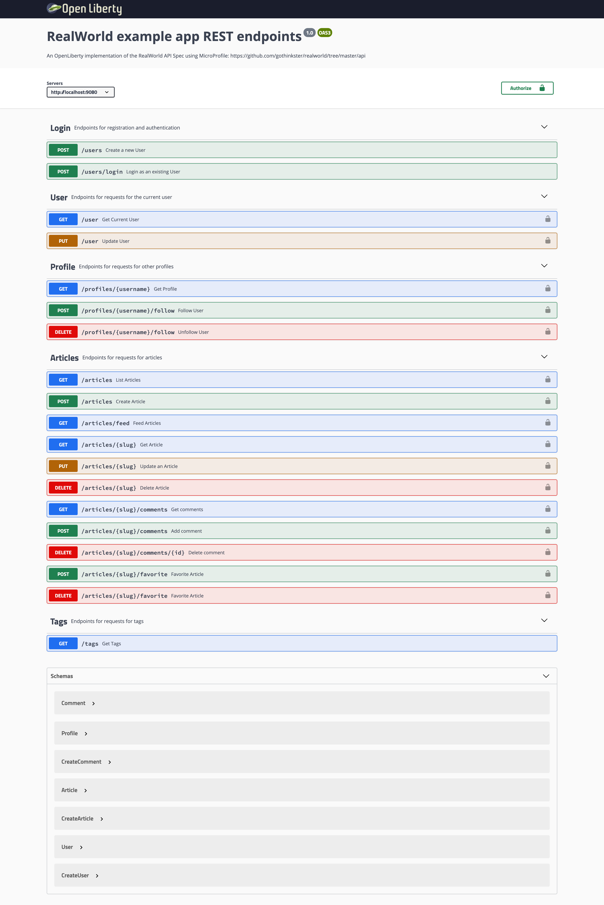

# 

> ### OpenLiberty + JPA codebase containing real world examples (CRUD, auth, advanced patterns, etc) that adheres to the [RealWorld](https://github.com/gothinkster/realworld) spec and API.

### [Demo](https://github.com/gothinkster/realworld)&nbsp;&nbsp;&nbsp;&nbsp;[RealWorld](https://github.com/gothinkster/realworld)

This codebase was created to demonstrate a fully fledged fullstack application built with OpenLiberty + MicroProfile + JPA including CRUD operations, authentication, routing, pagination, and more.

For more information on how to this works with other frontends/backends, head over to the [RealWorld](https://github.com/gothinkster/realworld) repo.

# Getting started

You will need Java as a prerequisite and our current build tool of choice is Maven.
* Clone this repo
* To build, run `mvn clean install`
* To start the server, 
    * as a back ground process, run `mvn liberty:start`
    * as a foreground process, run `mvn liberty:run`
    * in [dev mode](https://openliberty.io/docs/latest/development-mode.html), run `mvn liberty:dev`

Once the server has started,  head to http://localhost:9080/openapi/ui to interact with the endpoints defined in [the spec](https://github.com/gothinkster/realworld/tree/master/api#single-article).

Some endpoints require authentication. To simulate signing in, from the OpenAPI UI:
1. *Create a User*: Click on the `/users` POST endpoint, then click `Try it out`. Update the `Request body` to the details you'd like then hit `Execute`.
2. *Authenticate*: Once your new User has been created, copy the `token` from the `Response Body`. Click the green `Authorize` button (with the pad lock icon) in the top right of the UI, and paste the token value into the `Value` box before hitting the `Authorize` button. This will make any requests made using the UI from the new User with their valid JWT token, until either the token expires or the page is refreshed.

Note: The `/users/login` endpoint doesn't actually authenticate the specified user. It simply returns a valid JWT token, which can then be used to authenticate the session as described in point #2.

